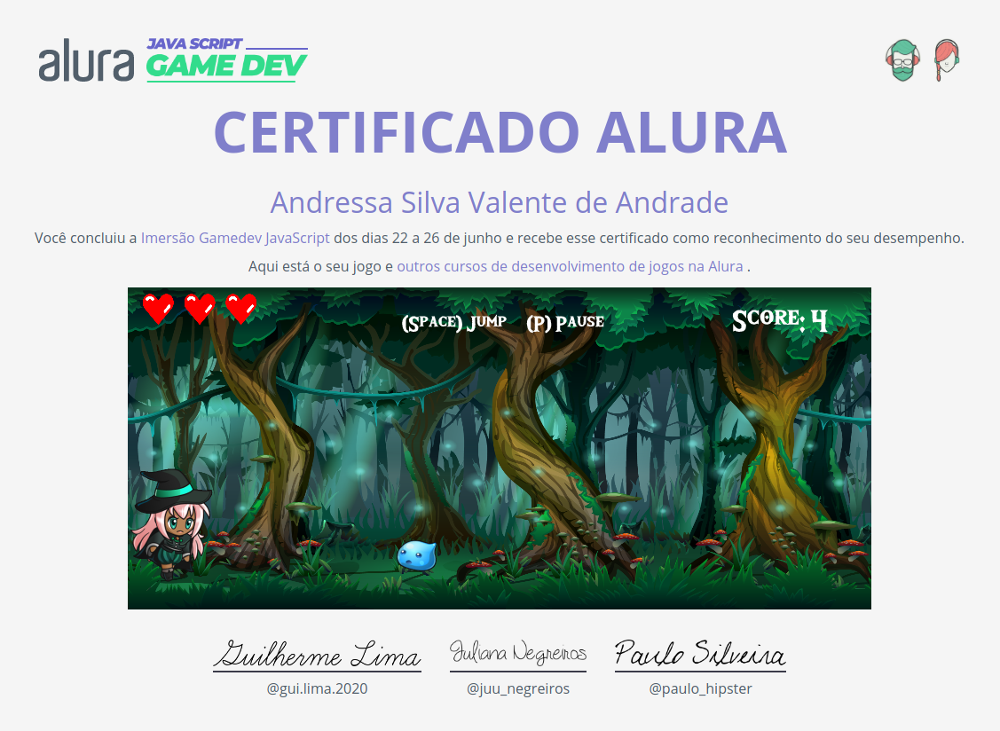

# 💻 Imersão GameDev da Alura
Durante a semana de 22 a 26 de Junho a Alura proporcionou uma imersão de desenvolvimento de jogos utilizando a biblioteca , as aulas contemplaram: animações básicas, trilha sonora, pulos, efeitos sonoros, colisão, personagens, pontuação, estado do jogo, vidas e mapa.

## Comandos:
- Pressione SPACE para pular (é possível fazer um pulo duplo)
- Pressione P para pausar
- Pressione ENTER para voltar a tela inicial

## Certificado

## Jogo
Link: https://andressandrade.github.io/javascript-runner-game/

## 📝Licença

Este projeto está sob a licença [MIT](LICENSE).
